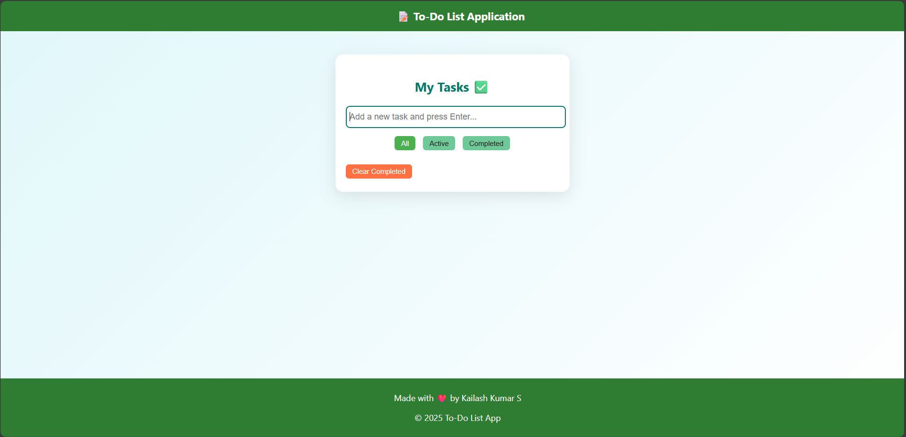

# Ex03 To-Do List using JavaScript
## Date:24.10.2025

## AIM
To create a To-do Application with all features using JavaScript.

## ALGORITHM
### STEP 1
Build the HTML structure (index.html).

### STEP 2
Style the App (style.css).

### STEP 3
Plan the features the To-Do App should have.

### STEP 4
Create a To-do application using Javascript.

### STEP 5
Add functionalities.

### STEP 6
Test the App.

### STEP 7
Open the HTML file in a browser to check layout and functionality.

### STEP 8
Fix styling issues and refine content placement.

### STEP 9
Deploy the website.

### STEP 10
Upload to GitHub Pages for free hosting.

## PROGRAM
HTML:
```html
<!DOCTYPE html>
<html lang="en">
<head>
  <meta charset="UTF-8" />
  <meta name="viewport" content="width=device-width, initial-scale=1.0"/>
  <title>To-Do List App</title>
  <link rel="stylesheet" href="style.css">
</head>
<body>
  <header>📝 To-Do List Application</header>

  <div class="todo-container">
    <h2>My Tasks ✅</h2>
    <input
      type="text"
      id="todo-input"
      class="todo-input"
      placeholder="Add a new task and press Enter..."
    />
    <div class="filter-bar">
      <button data-filter="all" class="active">All</button>
      <button data-filter="active">Active</button>
      <button data-filter="completed">Completed</button>
    </div>
    <ul id="todo-list" class="todo-list"></ul>
  </div>

    <footer>
        <p>Made with ❤️ by Ashwin Kumar A</p>
        <p>© 2025 To-Do List App</p>
    </footer>
  <script src="script.js"></script>
</body>
</html>

```
CSS
```css
/* General Page Styles */
body {
  font-family: 'Segoe UI', Tahoma, Geneva, Verdana, sans-serif;
  margin: 0;
  padding: 0;
  background: linear-gradient(135deg, #e0f7fa, #ffffff);
  display: flex;
  justify-content: center;
  align-items: flex-start;
  min-height: 100vh;
}
header{
  width: 100%;
  background-color: #2e7d32;
  color: white;
  padding: 15px;
  text-align: center;
  font-size: 20px;
  font-weight: bold;
  position: fixed;
  left: 0;
}
footer{
  width: 100%;
  background-color: #2e7d32;
  color: white;
  padding: 10px;
  text-align: center;
  font-size: 10px;
  font-weight: bold;
  position: fixed;
  left: 0;
}
header { top: 0; }
footer {
  bottom: 0;
  font-size: 20px;
  font-weight: normal;
}

/* Todo Container */
.todo-container {
  background: #ffffff;
  padding: 25px 20px;
  border-radius: 15px;
  box-shadow: 0 8px 30px rgba(0, 0, 0, 0.1);
  width: 100%;
  max-width: 400px;
  margin: 100px auto 70px auto;
}

h2 {
  text-align: center;
  margin-bottom: 20px;
  color: #00796b;
}

/* Input Box */
.todo-input {
  width: 100%;
  padding: 10px 5px;
  border: 2px solid #b2dfdb;
  border-radius: 8px;
  margin-bottom: 15px;
  font-size: 16px;
  outline: none;
  transition: border-color 0.3s;
}
.todo-input:focus {
  border-color: #00796b;
}

/* Filter Bar */
.filter-bar {
  margin-bottom: 15px;
  text-align: center;
}
.filter-bar button {
  padding: 6px 12px;
  margin: 0 5px;
  border: none;
  border-radius: 6px;
  cursor: pointer;
  background: #6fc897;
  color: #1a191b;
  transition: background 0.3s;
}
.filter-bar button.active {
  background: #4caf50;
  color: white;
}

/* Todo List */
.todo-list {
  list-style: none;
  padding: 0;
}
.todo-item {
  background: #f1f8e9;
  padding: 12px 15px;
  margin-bottom: 10px;
  border-radius: 8px;
  display: flex;
  justify-content: space-between;
  align-items: center;
  transition: background 0.3s;
}
.todo-item:hover {
  background: #dcedc8;
}
.todo-item.completed span {
  text-decoration: line-through;
  color: gray;
}

/* Buttons */
.todo-buttons button {
  padding: 5px 10px;
  border: none;
  border-radius: 6px;
  cursor: pointer;
  margin-left: 5px;
}
.complete-btn {
  background-color: #00796b;
  color: white;
}
.delete-btn {
  background-color: #e53935;
  color: white;
}

/* Responsive */
@media (max-width: 480px) {
  .todo-container {
    width: 90%;
    margin: 120px auto 80px auto;
    padding: 20px;
  }
}

```
JAVASCRIPT
```java
// DOM references
const todoInput = document.getElementById('todo-input');
const todoList  = document.getElementById('todo-list');
const filterBtns = document.querySelectorAll('.filter-bar button');

// State
let todos = [];      // { id, text, completed }
let filter = 'all';  // all | active | completed

// Init
loadTodos();
renderTodos();

// Add new task on Enter
todoInput.addEventListener('keypress', e => {
  if (e.key === 'Enter') {
    e.preventDefault();
    addTodo();
  }
});

// Filter buttons
filterBtns.forEach(btn =>
  btn.addEventListener('click', () => {
    filterBtns.forEach(b => b.classList.toggle('active', b === btn));
    filter = btn.dataset.filter;
    renderTodos();
  })
);

// CRUD
function addTodo() {
  const text = todoInput.value.trim();
  if (!text) return;
  todos.push({ id: Date.now(), text, completed: false });
  saveTodos();
  renderTodos();
  todoInput.value = '';
}

function toggleComplete(id) {
  todos = todos.map(t =>
    t.id === id ? { ...t, completed: !t.completed } : t
  );
  saveTodos();
  renderTodos();
}

function deleteTodo(id) {
  todos = todos.filter(t => t.id !== id);
  saveTodos();
  renderTodos();
}

// Persistence
function loadTodos() {
  const data = localStorage.getItem('todos');
  if (data) {
    try { todos = JSON.parse(data); }
    catch { todos = []; }
  }
}
function saveTodos() {
  localStorage.setItem('todos', JSON.stringify(todos));
}

// Render
function renderTodos() {
  todoList.innerHTML = '';
  todos
    .filter(t => {
      if (filter === 'active')    return !t.completed;
      if (filter === 'completed') return t.completed;
      return true;
    })
    .forEach(({ id, text, completed }) => {
      const li = document.createElement('li');
      li.className = `todo-item${completed ? ' completed' : ''}`;

      const span = document.createElement('span');
      span.textContent = text;

      const btns = document.createElement('div');
      btns.className = 'todo-buttons';

      const comp = document.createElement('button');
      comp.textContent = completed ? 'Undo' : 'Complete';
      comp.className = 'complete-btn';
      comp.onclick = () => toggleComplete(id);

      const del = document.createElement('button');
      del.textContent = 'Delete';
      del.className = 'delete-btn';
      del.onclick = () => deleteTodo(id);

      btns.append(comp, del);
      li.append(span, btns);
      todoList.appendChild(li);
    });
}

```

## OUTPUT



## RESULT
The program for creating To-do list using JavaScript is executed successfully.
